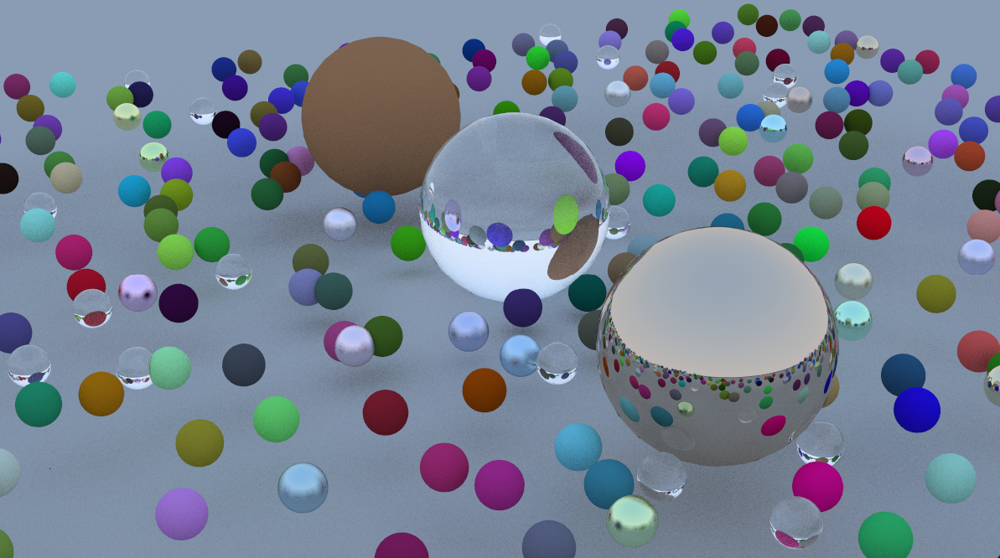

# Raystart

Real-time ray tracing renderer built on Vulkan. 

## About

A GPU-accelerated ray tracing project that renders photorealistic 3D scenes in real time. Based on the *Ray Tracing in One Weekend* series

## What It Does

- **Realistic reflections, glass, and metals** — physically-based light bouncing, refraction, and material shading

- **GPU-driven path tracing** — ray tracing pipeline from CPU to GPU using Vulkan's hardware-accelerated ray tracing extension

## Tech Stack

- Vulkan + Vulkan Ray Tracing Extension
- GLSL Shaders
- C++

## Roadmap

- **SVGF (Spatiotemporal Variance-Guided Filtering)** — denoise low-sample-count frames by combining spatial edge-aware filtering with temporal accumulation, producing clean images from noisy single-bounce output without waiting for thousands of samples to converge

- **Light Sources** — support for point lights, area lights, and other light types for richer scene lighting

- **Next Event Estimation (NEE)** — shoot rays directly toward lights for faster and more accurate shadow and illumination calculation

- **Adaptive Temporal Filtering** — Detect lighting changes via temporal gradients (A-SVGF antilag) and reduce history weight in affected regions to eliminate ghosting artifacts caused by dynamic lights

## Reference

- Ray Tracing in One Weekend - Peter Shirley, Trevor David Black, Steve Hollasch (https://raytracing.github.io/)
- Spatiotemporal Variance-Guided Filtering: Real-Time Reconstruction for Path-Traced Global Illumination (https://cg.ivd.kit.edu/publications/2017/svgf/svgf_preprint.pdf)
- Gradient Estimation for Real-Time Adaptive Temporal Filtering - Christoph Schied, Christoph Peters, Carsten Dachsbacher (https://cg.ivd.kit.edu/atf.php)