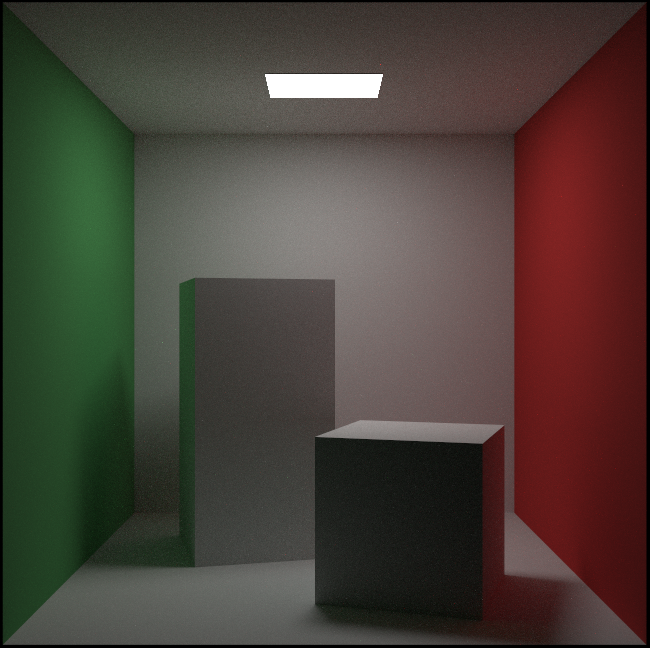
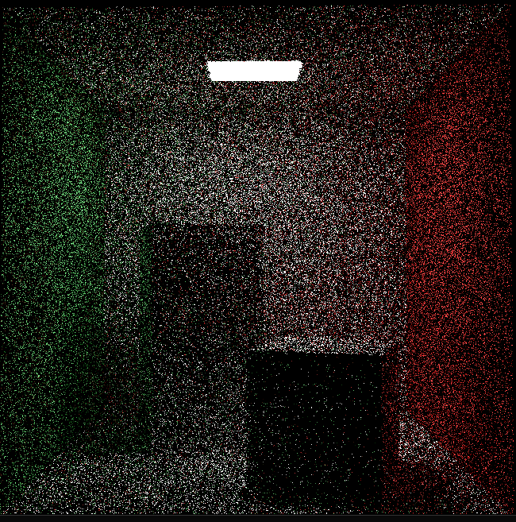
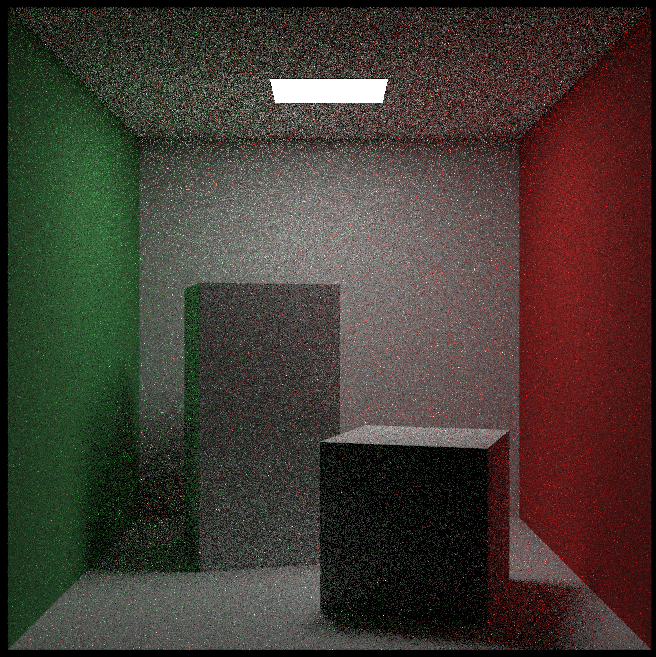
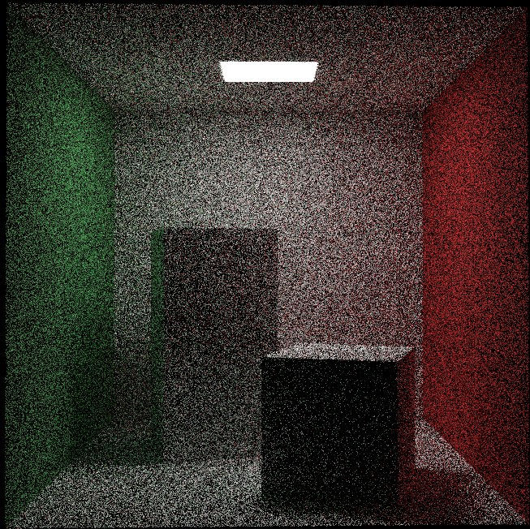
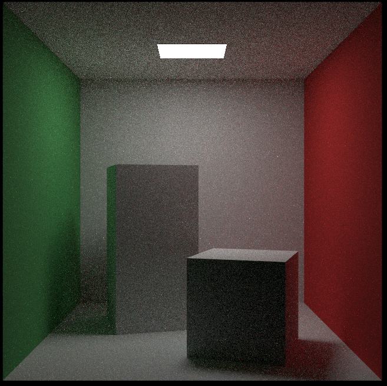

# Raystart

Real-time ray tracing renderer built on Vulkan. 

## About

A GPU-accelerated ray tracing project that renders photorealistic 3D scenes in real time. Based on the *Ray Tracing in One Weekend* series

## What It Does

- **Realistic reflections, glass, and metals** — physically-based light bouncing, refraction, and material shading, improved with mixture densities.

- **GPU-driven path tracing** — ray tracing pipeline from CPU to GPU using Vulkan's hardware-accelerated ray tracing extension

## Importance Sampling & Mixture Densities result

Monte Carlo integration with **mixture densities** drastically cuts noise at the same sample count. *Before* uses cosine-weighted sampling; *after* mixes in light-aware importance sampling.

| Samples | Before | After |
|:---:|:---:|:---:|
| 10 spp |  |  |
| 50 spp |  |  |

## Tech Stack

- Vulkan + Vulkan Ray Tracing Extension
- GLSL Shaders
- C++

## Roadmap

- ✅**Light Sources** — support for light types for richer scene lighting

- ✅**Importance Sampling with mixture densities** — shoot rays directly toward lights and mix them with cosine-weighted sampling

- **Next Event Estimation (Bernhard Kerbl)** — split lighting into separate **direct** (shadow ray) and **indirect** (BRDF bounce) estimators, instead of merging both into a single mixture-density ray

- **Adaptive Temporal Filtering** — Detect lighting changes via temporal gradients (A-SVGF antilag) and reduce history weight in affected regions to eliminate ghosting artifacts caused by dynamic lights

## Reference

- Ray Tracing in One Weekend series - Peter Shirley, Trevor David Black, Steve Hollasch (https://raytracing.github.io/)
- Rendering: Next Event Estimation - Bernhard Kerbl, TU Wien Research Unit of Computer Graphics (https://www.cg.tuwien.ac.at/courses/Rendering/VU)
- Gradient Estimation for Real-Time Adaptive Temporal Filtering - Christoph Schied, Christoph Peters, Carsten Dachsbacher (https://cg.ivd.kit.edu/atf.php)